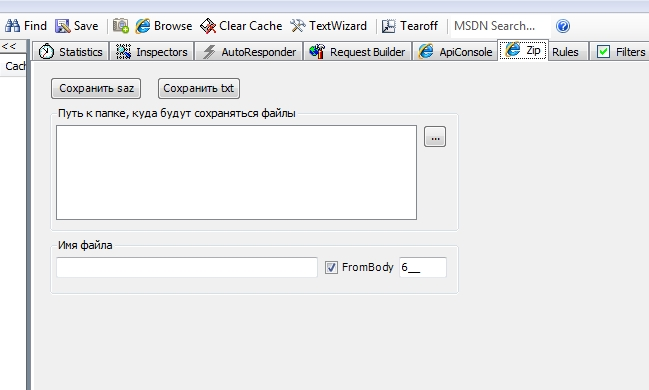

Extension for [Fiddler](http://www.fiddler2.com/Fiddler/dev/).



The source code: [FiddlerZip](https://drive.google.com/file/d/0BwVmorgjT-W1NDFlZDZkMDItMWMxMS00NzU2LTg3NDUtYTYzOWVhOGMyMzRj/view).

The main code:

```cs
using System;
using System.Collections.Generic;
using System.Linq;
using System.Text;
using Fiddler;
using System.Windows.Forms;

// It is important !!! see the current version of fiddler
[assembly: Fiddler.RequiredVersion("2.3.4.4")]

namespace FiddlerZip
{
    /// <summary>
    /// Zip extension
    /// </summary>
    public class Zip : IFiddlerExtension
    {
        /// <summary>
        /// page for extesnion
        /// </summary>
        private TabPage oPage;
        /// <summary>
        /// Control that presented extension
        /// </summary>
        private ZipControl oAppConsole;
        #region IFiddlerExtension Members

        public void OnBeforeUnload()
        {

        }

        public void OnLoad()
        {
            // create tab with name "Zip"
            oPage = new TabPage("Zip");
            // it is possible to add icon to your tab
            oPage.ImageIndex = (int)Fiddler.SessionIcons.FilterBrowsers;
            oAppConsole = new ZipControl();
            // add control to tab
            oPage.Controls.Add(oAppConsole);
            oAppConsole.Dock = DockStyle.Fill;
            FiddlerApplication.UI.tabsViews.TabPages.Add(oPage);
        }

        #endregion
    }
}
```
