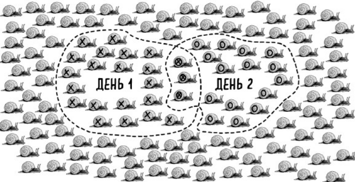

The ratio of the number of snails recaptured to the total number caught on the second day should be the same as the ratio of the number of snails caught on the first day to the total number of snails in the garden, tagged and untagged.

1. What is done, it is done. A lot of processes are following [exponential growth](https://en.wikipedia.org/wiki/Exponential_growth) rule. Don't forget it.
2. It is always better to check twice to increase probability of the right answer.
3. People tend to take mathematical formulas on faith, agree with them by default and do not require further explanation. The aura of mystery that surrounds many mathematical calculations makes them sometimes mysteriously incomprehensible and (often undeservedly) incredibly convincing. So they are rarely challenged. The mathematical formula creates an illusion of certainty, disarming possible skeptics. Ask questions and clarifications (or ask other experts) to clarify provided mathematical formulas and proofs.
4. Statistics can be chosen to represent a particular way of looking at things while maintaining a seeing of objectivity. Figures that contradict the conclusion are simply ignored, and reality is distorted through the selective use of data. Small, unrepresentative, or biased samples, combined with leading questions and selective presentation of data, or using statistics out of context, is a recipe for unreliable statistical research. Check the provided statistics carefully.
5. To select the best option, decline first 37% of options, and then select the first one that is better than declined options.
